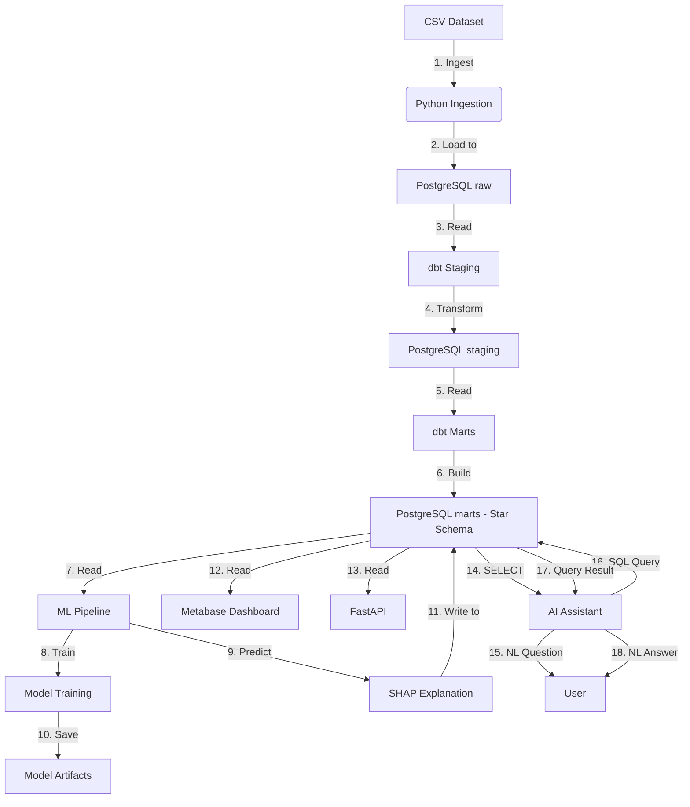

# COMPONENT ARCHITECTURE

**Dự án:** Ecommerce Fraud Detection Data Warehouse  
**Phase:** 07 — System Architecture  
**Ngày tạo:** 02/09/2026  

---

## 1. THÀNH PHẦN HỆ THỐNG

Hệ thống được chia thành 5 lớp chính:

```text
┌─────────────────────────────────────────┐
│ Layer 1: Data Source                    │
│  ├─ train_transaction.csv (590K rows)    │
│  └─ train_identity.csv (144K rows)       │
└─────────────────────────────────────────┘

┌─────────────────────────────────────────┐
│ Layer 2: Ingestion & Storage            │
│  ├─ Python Ingestion Script             │
│  │   └─ ingestion/load_raw.py            │
│  └─ PostgreSQL Database                 │
│      ├─ schema: raw                     │
│      ├─ schema: staging                 │
│      └─ schema: marts                   │
└─────────────────────────────────────────┘

┌─────────────────────────────────────────┐
│ Layer 3: Orchestration & Transform      │
│  ├─ Apache Airflow                      │
│  │   └─ DAG: fraud_pipeline.py          │
│  └─ dbt Core                            │
│      ├─ models/staging/                 │
│      └─ models/marts/                   │
└─────────────────────────────────────────┘

┌─────────────────────────────────────────┐
│ Layer 4: ML & Explainable AI            │
│  ├─ Feature Engineering (ml/prepare_data.py) │
│  ├─ Model Training (ml/train.py)        │
│  │   ├─ Logistic Regression             │
│  │   ├─ Random Forest                   │
│  │   └─ XGBoost                         │
│  ├─ SHAP Explanation (ml/shap_explain.py)│
│  └─ Prediction (ml/predict.py)          │
└─────────────────────────────────────────┘

┌─────────────────────────────────────────┐
│ Layer 5: Analytics & Interaction        │
│  ├─ Metabase Dashboard                  │
│  ├─ FastAPI Service (api/main.py)       │
│  └─ AI Assistant (ai_assistant/)        │
│      ├─ nl_to_sql.py                    │
│      ├─ sql_validator.py                │
│      └─ nlp_response.py                 │
└─────────────────────────────────────────┘
```

---

## 2. THÀNH PHẦN CHI TIẾT

### 2.1. Python Ingestion (ingestion/)
- **File**: `ingestion/load_raw.py`
- **Purpose**: Đọc CSV → PostgreSQL schema `raw`
- **Input**: `data/raw/train_transaction.csv`, `data/raw/train_identity.csv`
- **Output**: `raw.transactions`, `raw.identity` tables
- **Dependencies**: pandas, sqlalchemy, python-dotenv

### 2.2. PostgreSQL Database
- **Version**: PostgreSQL 15+ (Docker postgres:15-alpine)
- **Host**: localhost:5432
- **Database**: `ecommerce_fraud_dw`
- **Schemas**:
  - `raw` — dữ liệu nguồn, không biến đổi
  - `staging` — dbt staging models
  - `marts` — Star Schema (fact + dimension)
- **Users**:
  - `postgres` — full access (admin)
  - `ai_assistant_ro` — read-only access (cho AI Assistant)

### 2.3. dbt Core
- **Version**: dbt-core 1.7+
- **Purpose**: Transform staging → marts (Star Schema)
- **Models**:
  - `staging/stg_transactions.sql` — clean, type cast
  - `staging/stg_identity.sql` — clean, type cast
  - `marts/fact_transaction.sql` — fact table
  - `marts/fact_fraud_prediction.sql` — prediction fact
  - `marts/dim_*.sql` — dimension tables
- **Tests**: not_null, unique, relationships, accepted_values

### 2.4. Apache Airflow
- **Version**: Airflow 2.8+ (via Docker)
- **Purpose**: Orchestrate pipeline
- **DAG**: `airflow/dags/fraud_pipeline.py`
- **Tasks**:
  - `check_source` — kiểm tra dataset tồn tại
  - `ingest_raw` — chạy ingestion script
  - `validate_raw` — kiểm tra row count
  - `dbt_run` — chạy dbt models
  - `dbt_test` — chạy dbt tests
  - `ml_train` — train models
  - `ml_predict` — dự đoán + lưu vào DW
  - `quality_check` — data quality final check

### 2.5. Machine Learning
- **Location**: `ml/` directory
- **train.py**: Train LR, RF, XGBoost
- **evaluate.py**: Compare metrics (Precision, Recall, F1, ROC-AUC, PR-AUC)
- **shap_explain.py**: SHAP global + local explanation
- **predict.py**: Load best model, predict, save to DW
- **saved_models/**: Model artifacts (.pkl, .joblib)

### 2.6. Metabase Dashboard
- **Port**: 3000
- **Purpose**: Visualize DW data
- **KPIs**: Transaction count, fraud rate, risk distribution, etc.

### 2.7. FastAPI
- **Location**: `api/main.py`
- **Port**: 8000
- **Endpoints**:
  - `/api/health` — health check
  - `/api/predict` — fraud prediction
  - `/api/transactions` — query transactions
  - `/api/fraud` — query fraud results

### 2.8. AI Assistant
- **Location**: `ai_assistant/`
- **Purpose**: Text-to-SQL trên DW (read-only)
- **Components**:
  - `nl_to_sql.py` — LLM generate SQL từ câu hỏi
  - `sql_validator.py` — validate SQL (chỉ SELECT)
  - `nlp_response.py` — format kết quả thành natural language

---

## 3. COMPONENT INTERACTION DIAGRAM



*Cập nhật: 02/09/2026 | Version: 1.0*
