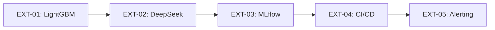

# PHASE 30 — Extension (POST-CORE)

## 1. MỤC TIÊU

Các tính năng mở rộng nếu hoàn thành đúng tiến độ:

---

## 2. EXTENSION BACKLOG

| ID | Tính năng | Trọng số | Thời gian | Mô tả |
|----|-----------|----------|-----------|-------|
| EXT-01 | LightGBM model | HIGH | 2 ngày | Thử nghiệm LightGBM, so sánh với XGBoost |
| EXT-02 | DeepSeek API | MEDIUM | 1 ngày | Thay thế Ollama cho AI Assistant |
| EXT-03 | Model versioning | MEDIUM | 2 ngày | MLflow để track experiments |
| EXT-04 | CI/CD pipeline | MEDIUM | 1 ngày | GitHub Actions cho tests |
| EXT-05 | Alerting | LOW | 1 ngày | Email/slack khi fraud rate tăng đột biến |
| EXT-06 | Batch prediction | LOW | 1 ngày | Predict trên toàn bộ test_transaction.csv |
| EXT-07 | Feature store | LOW | 3 ngày | Feast hoặc tự build feature store |
| EXT-08 | Real-time scoring | LOW | 3 ngày | WebSocket API cho real-time prediction |

---

## 3. EXT-01 — LightGBM

```bash
pip install lightgbm
```

File: `ml/train_lightgbm.py`

```python
import lightgbm as lgb
from sklearn.metrics import roc_auc_score

model = lgb.LGBMClassifier(
    n_estimators=500,
    max_depth=7,
    learning_rate=0.05,
    num_leaves=127,
    subsample=0.8,
    colsample_bytree=0.8,
    random_state=42,
    n_jobs=-1,
    class_weight='balanced',
    scale_pos_weight=18,
    verbose=-1
)

model.fit(X_train, y_train,
          eval_set=[(X_val, y_val)],
          callbacks=[lgb.early_stopping(50)])

auc = roc_auc_score(y_val, model.predict_proba(X_val)[:, 1])
joblib.dump(model, 'ml/models/lgb_model.pkl')
```

---

## 4. EXT-02 — DeepSeek API

Cập nhật `ai_assistant/main.py`:

```python
from langchain_openai import ChatOpenAI

llm = ChatOpenAI(
    model="deepseek-chat",
    api_key=os.getenv("DEEPSEEK_API_KEY"),
    base_url="https://api.deepseek.com",
    temperature=0.7,
)
```

Environment:
```env
DEEPSEEK_API_KEY=sk-...  # From deepseek.com
```

---

## 5. EXT-03 — MLflow Integration

```bash
pip install mlflow
```

File: `ml/mlflow_setup.py`

```python
import mlflow
from mlflow.tracking import MlflowClient

mlflow.set_tracking_uri("http://localhost:5000")
mlflow.set_experiment("fraud_detection")

with mlflow.start_run():
    mlflow.log_param("model", "XGBoost")
    mlflow.log_metric("auc", best_auc)
    mlflow.sklearn.log_model(model, "model")
    
    # Log feature importance
    fig = plot_importance(...)
    mlflow.log_figure(fig, "feature_importance.png")
```

docker-compose.yml addition:
```yaml
  mlflow:
    image: mlflow/mlflow:2.11.1
    ports:
      - "5000:5000"
    volumes:
      - mlflow_data:/mlflow
    environment:
      - BACKEND_STORE_URI=sqlite:///mlflow/mlflow.db
      - DEFAULT_ARTIFACT_ROOT=/mlflow

volumes:
  mlflow_data:
```

---

## 6. EXT-04 — CI/CD Pipeline

File: `.github/workflows/ci.yml`

```yaml
name: CI Pipeline
on: [push, pull_request]

jobs:
  test:
    runs-on: ubuntu-latest
    services:
      postgres:
        image: postgres:15
        env:
          POSTGRES_USER: postgres
          POSTGRES_PASSWORD: postgres
          POSTGRES_DB: ecommerce_fraud_dw
    steps:
      - uses: actions/checkout@v4
      - uses: actions/setup-python@v5
        with: {python-version: '3.10'}
      - run: pip install -r requirements.txt pytest pytest-cov
      - run: pytest tests/ --cov=. -v
```

---

## 7. EXT-05 — Alerting

File: `ml/alerting.py`

```python
"""Detect anomaly in fraud rate and send alerts."""
import psycopg2
import smtplib
from datetime import datetime, timedelta

def check_fraud_rate_spike(threshold=0.05):
    """Check if today's fraud rate is above threshold."""
    conn = psycopg2.connect(DB_URL)
    cur = conn.cursor()
    
    # Get today's fraud rate
    cur.execute(f"""
        SELECT COUNT(CASE WHEN is_fraud = 1 THEN 1 END) * 100.0 / COUNT(*) as rate
        FROM marts.predictions
        WHERE predicted_at >= NOW() - INTERVAL '1 hour'
    """)
    rate = cur.fetchone()[0]
    
    if rate > threshold:
        send_alert(f"⚠️ Fraud rate spike: {rate:.2f}% in last hour")
    
    conn.close()

def send_alert(message):
    """Send email alert."""
    # Implementation using smtplib or Slack webhook
    pass
```

---

## 8. EXTENSION PRIORITIZATION



**Priority order (nếu còn thời gian):**
1. EXT-01 LightGBM (compare with XGBoost)
2. EXT-02 DeepSeek API (improve AI Assistant accuracy)
3. EXT-03 MLflow (reproducibility + experiment tracking)
4. EXT-04 CI/CD (automate testing)
5. EXT-05 Alerting (production monitoring)

---

## 9. Liên hệ

- Trước: [PHASE 29 — Final Documentation](../29_final/final_documentation.md)
- Chapter 4.10 in đề cương

*Cập nhật: 02/09/2026 | Version: 1.0*
